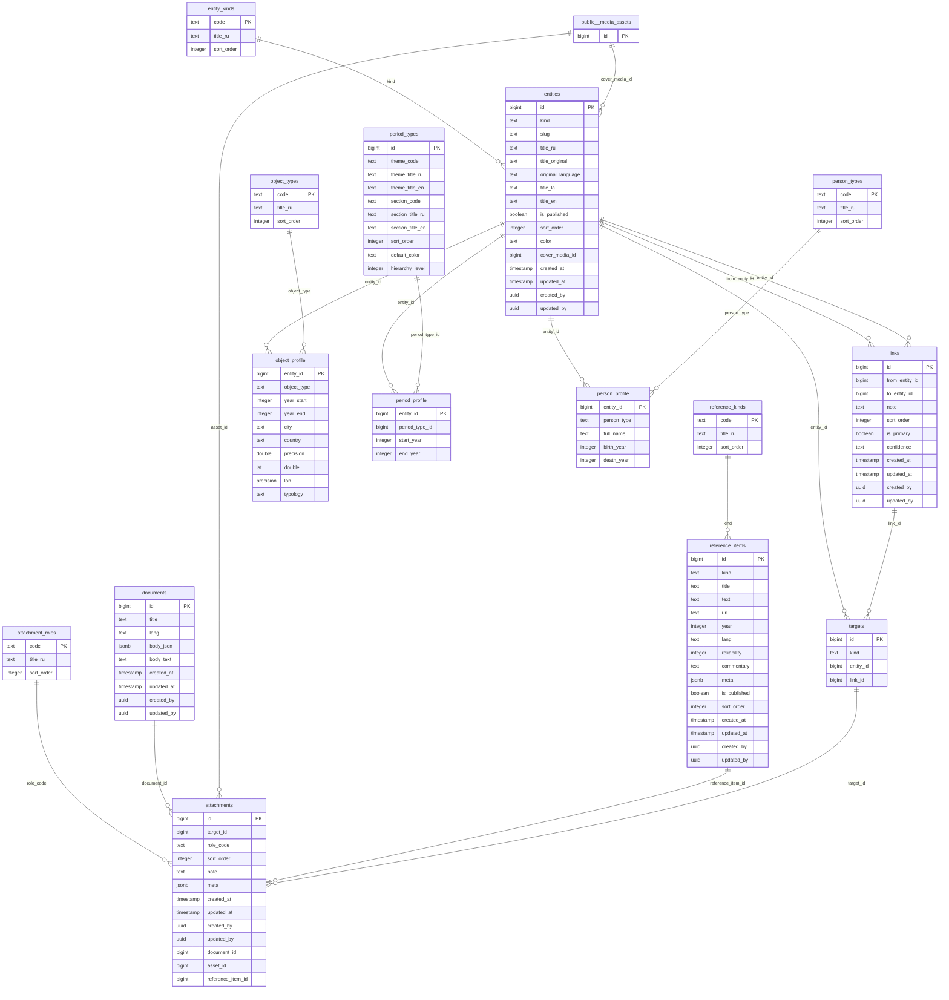

```mermaid
erDiagram
  attachment_roles {
    text code PK
    text title_ru
    integer sort_order
  }
  attachments {
    bigint id PK
    bigint target_id
    text role_code
    integer sort_order
    text note
    jsonb meta
    timestamp created_at
    timestamp updated_at
    uuid created_by
    uuid updated_by
    bigint document_id
    bigint asset_id
    bigint reference_item_id
  }
  documents {
    bigint id PK
    text title
    text lang
    jsonb body_json
    text body_text
    timestamp created_at
    timestamp updated_at
    uuid created_by
    uuid updated_by
  }
  entities {
    bigint id PK
    text kind
    text slug
    text title_ru
    text title_original
    text original_language
    text title_la
    text title_en
    boolean is_published
    integer sort_order
    text color
    bigint cover_media_id
    timestamp created_at
    timestamp updated_at
    uuid created_by
    uuid updated_by
  }
  entity_kinds {
    text code PK
    text title_ru
    integer sort_order
  }
  links {
    bigint id PK
    bigint from_entity_id
    bigint to_entity_id
    text note
    integer sort_order
    boolean is_primary
    text confidence
    timestamp created_at
    timestamp updated_at
    uuid created_by
    uuid updated_by
  }
  object_profile {
    bigint entity_id PK
    text object_type
    integer year_start
    integer year_end
    text city
    text country
    double precision lat
    double precision lon
    text typology
  }
  object_types {
    text code PK
    text title_ru
    integer sort_order
  }
  period_profile {
    bigint entity_id PK
    bigint period_type_id
    integer start_year
    integer end_year
  }
  period_types {
    bigint id PK
    text theme_code
    text theme_title_ru
    text theme_title_en
    text section_code
    text section_title_ru
    text section_title_en
    integer sort_order
    text default_color
    integer hierarchy_level
  }
  person_profile {
    bigint entity_id PK
    text person_type
    text full_name
    integer birth_year
    integer death_year
  }
  person_types {
    text code PK
    text title_ru
    integer sort_order
  }
  public__media_assets {
    bigint id PK
  }
  reference_items {
    bigint id PK
    text kind
    text title
    text text
    text url
    integer year
    text lang
    integer reliability
    text commentary
    jsonb meta
    boolean is_published
    integer sort_order
    timestamp created_at
    timestamp updated_at
    uuid created_by
    uuid updated_by
  }
  reference_kinds {
    text code PK
    text title_ru
    integer sort_order
  }
  targets {
    bigint id PK
    text kind
    bigint entity_id
    bigint link_id
  }
  attachment_roles ||--o{ attachments : "role_code"
  documents ||--o{ attachments : "document_id"
  public__media_assets ||--o{ attachments : "asset_id"
  reference_items ||--o{ attachments : "reference_item_id"
  targets ||--o{ attachments : "target_id"
  entity_kinds ||--o{ entities : "kind"
  public__media_assets ||--o{ entities : "cover_media_id"
  entities ||--o{ links : "from_entity_id"
  entities ||--o{ links : "to_entity_id"
  entities ||--o{ object_profile : "entity_id"
  object_types ||--o{ object_profile : "object_type"
  entities ||--o{ period_profile : "entity_id"
  period_types ||--o{ period_profile : "period_type_id"
  entities ||--o{ person_profile : "entity_id"
  person_types ||--o{ person_profile : "person_type"
  reference_kinds ||--o{ reference_items : "kind"
  entities ||--o{ targets : "entity_id"
  links ||--o{ targets : "link_id"
```
